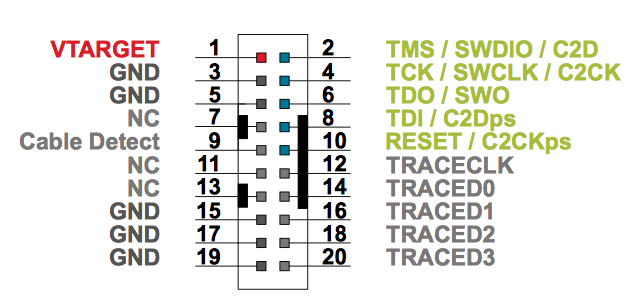
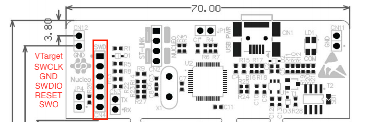

# Hatch Firmware for EFR32 Series MCUs

This repository contains the firmware for Hatch products.

Dependencies
=====
You might need to install the following packages to build the firmware:
 - gcc-arm-none-eabi
 - cmake

If you want to program and debug the hatch, you will need to install following packages:
 - gdb-arm-none-eabi
 - jlink or openocd with EFR32 patched

Further more, if you would like to build documentations, you will need to install following packages:
 - doxygen

Optionally, `cppcheck`, a static code analyzer is helpful finding potential bugs or defects without programming the hatch.
 - cppcheck
 
Branches
=====
This repository contains three branches:
- stable: protected from pushing, can only be merge from development branch. Need to pass all tests.
- development: protected from pushing, can only be merge from development branch. Need to pass all unit tests.
- experimental: allow pushing or merging from other branches.

Tools
=====
There are several tools available when building or debugging the hatch:
- build_debug.sh: generate build scripts with debug symbols enabled (-O1).
- cleanup.sh: remove all CMake cache files and folders (need to run `build_debug.sh` for the next build).
- openocd_start.sh: start the OpenOCD with busbuster configuration loaded.
- program.sh: load program onto the hatch.
- gdb.sh: remotely debug the device using gdb. With `reset` parameter when executing the script, the program on hatch will be restarted and break at the start of `main()`.

Continuous Integration
=====
For building and testing devices, especially done by Jenkins, you might need to add Jenkins' account to both `dialout` and `plugdev` user group, allowing USB and Serial devices to be accessable.

sudo adduser jenkins dialout
sudo adduser jenkins plugdev

Debug
=====
I would recommend all developer to use JLink since it is more reliable, and have full support of EFR32 series micro
controllers. However, ST-Link can also be used as a fallback option. 

JLink
-----
The JLink debugger is embedded in EFR32 development kit. The debug connector can be found in Figure below:

To use JLink to program & debug the hatch device, the debugger need to switch the debug mode to "Debug OUT" in Simplicity
Studio. If you see an amber LED on next to the debugger, you are good to go. 

ST-Link with NUCLEO board
-----
Alternatively, you can use ST-Link to program & debug the hatch device. The debug connector on ST-Link can be found in 
Figure below:

Due to the insufficient support of EFR32 micro controllers in OpenOCD 0.10, developers need to build OpenOCD from source
with special patch applied. For more information, please refer to the repository for the [patch](https://github.com/ranbaowirelessguard/openocd_efr32).

Note: Ubuntu 17.10 have dependency issue with `libusb` so far. Any older version of Ubuntu should work fine.

How-to
------
1. To build to firmware, you need to configure the target first by executing 

        ./build_board_xxx.sh
    
    Where `xxx` represents the target you are going to build with. 

2. If no error occurred in previous stage, you should be able to build the firmware now using make tool

        make -jx
       
    Where `x` is the number of parallel build jobs. 

3. You should have one debug server running at background now, either OpenOCD or JLink Debug Server.

        ./jlink_start_swd.sh
        
    or
    
        ./openocd_start.sh
        
    If no error shown in this step, move on to the next step. 
    
4. Load the program to Hatch via Debugger

        ./program.sh            # If you are using JLink
        ./program_openocd.sh    # If you are using OpenOCD
        
5. Debug using `arm-none-eabi-gdb`!

        ./debug.sh              # If you are using JLink
        ./debug_openocd.sh      # If you are using OpenOCD
