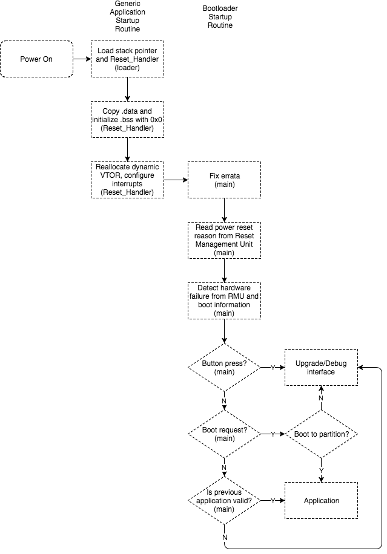

# Bootloader startup sequence

The following diagram shows the startup routine for bootloader, as implemented in `bootloader.c`.

Key File structure
--------------
- `target/efr32/crt0.c`: Generic application startup routine (self loaded)
- `target/efr32/scripts/efr32mg12p_bootloader.ld`: Linker script for the bootloader. 
The bootloader code is placed in the special reserved FLASH region (`0x0FE10000`) for the bootloader.
 - `main.c`: Main bootloader startup routine.
 - `bootloader.c`: Firmware upgrade/debug interface.

Note
----
All applications and bootloader will maintain the persistent memory location starting from `0x20000000`. 
The information stored on SRAM will not lose with software/hardware reset. Such memory region, also known as
`.RESETINFO` region, stores the critical device runtime information when fatal error occurred. The region also contains
partition information when switching between firmwares and the bootloader. Please refer `README.md` in `targets/efr32/drivers` folder. 
